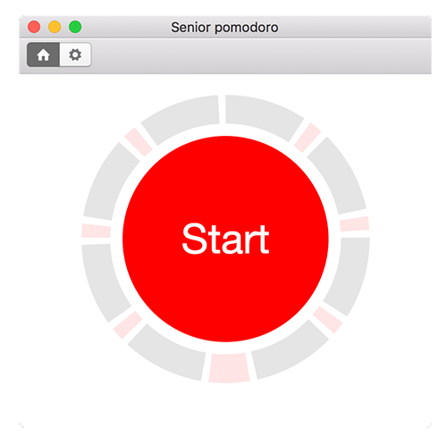

# Senior pomodoro

This is MacOS application to implement [Pomodoro Technique](https://en.wikipedia.org/wiki/Pomodoro_Technique). The technique uses a timer to break down work into intervals, traditionally 25 minutes in length, separated by short breaks. These intervals are named pomodoros, the plural in English of the Italian word pomodoro (tomato).

## Features

* Multy language realization
* Configurable break period and lunch time
* Flexible settings
* Desktop notification

## ToDO

* iPhone notification
* Hhistory and statistics

## Screenshot

## License

MIT © Denis Zavgorodny
